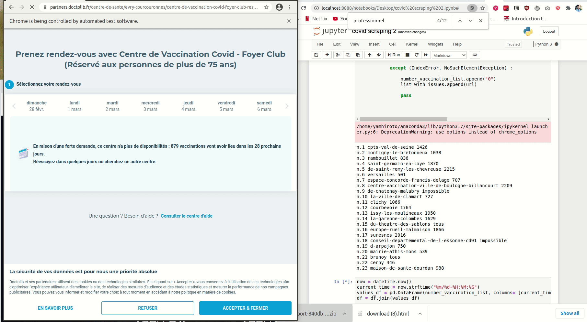

# selenium_vaccin

An ugly notebook usually built to find a vaccination appointment slot for my **dad**.

- Most of the vaccination centers are full, that's ridiculous.
- I ain't got the time to check it every 20 min, rather make use of my pricey tuition fees to write something helpful. 
- Send a **notification sound** and return the url if slots are available in one center (mp3 file in the git) 
- BE VERY FAST TO BOOK AS SOON AS YOU SEE A SLOT, please make sure you have all the relevant personal info for the person you are booking for beforehands
- Done using **Selenium** (it is really fun)
- I know, the Russian doll -like of  **Try&Catch** is ugly.

### EDIT [02/03/2021]: GOT AN APPOINTMENT for my dad!!!!

#### EDIT[18/04/2021]: appointment booked for my Mom in a busy center where it was nearly impossible to book one at that time (Versailles) 

#### EDIT [26/05/2021]: Appointments booked for two of my siblings with a customer facing job.  Latest version in action below:

